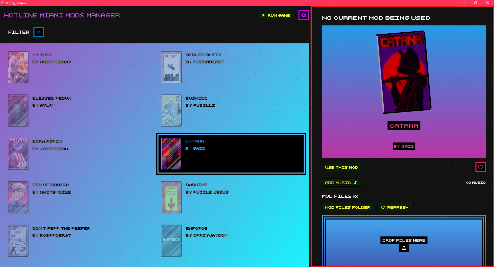
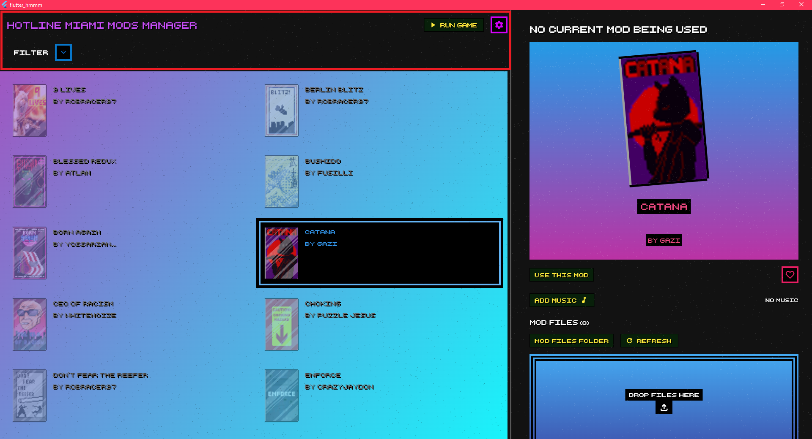
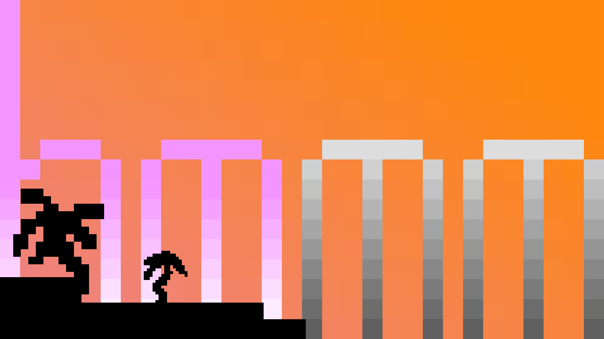

# Flutter Hmmm

A desktop application for managing and configuring Hotline Miami mods. This tool helps you organize, view, and manage your Hotline Miami mod collection with a modern, user-friendly interface.

## Download

You can download the latest version of the program [here](https://github.com/cds-reis/flutter_hmmm/releases).

## First-Time Setup

1. Launch the application
2. Select your game directory
3. Select your mods directory
4. Select the default music of the game

And you are done!

## Features in Detail

### Your mods

Here, we show all the mods you have subscribed to.

They don't need to have custom music or .patchwad files to appear here.

When you select a mod, it will be highlighted in the section to the right.

### Mod Details

Here, we show the details of the selected mod.

- You can press the "Use this mod" button to use the mod. It will copy the music and .patchwad files associated with it to the game directory.

- You can favorite the mod.

- You can add the music of the mod. When you press "Use this mod" button, the music you added will be the one that will be used.

- If you need, you can also remove the music of the mod.

- You can add all the .patchwad files of the mod. Like the music, when you press "Use this mod" button, all the .patchwad files will be added to the game directory.

- If you added a wrong .patchwad file by mistake, you can press the "Mod files folder" button. It will open the folder where the .patchwad files are located. You can then remove the wrong .patchwad file (If you do this, the program won't know you removed the file. so press the "Refresh" button to refresh the list of .patchwad files).

### App Bar

The app bar of the program, with some filters and configuration options.

- You can press the "Run Game" button to start Hotline Miami 2. Useful right after you select a mod to be used (Warning: It only works with Steam).

- Press the configuration button to configure the program.

- Press the "Filter" button to filter the mods.

- You can filter them by name, author, if they are a Level or a Campaign, and if they are a Favorite.

## Troubleshooting

The program is still in development. So, you might encounter some bugs.

If you do, please report them to the [issue tracker](https://github.com/cds-reis/flutter_hmmm/issues). Or reach to me directly too, it could work.

If you have any questions or suggestions, feel free to reach me too.

## Contributing

If you want to contribute to the project, feel free to fork the repository and create a pull request.

## License

This project is licensed under the MIT License. See the [LICENSE](LICENSE) file for details.

## Special thanks to u/ORBC0RP for providing the icon and art for the program

